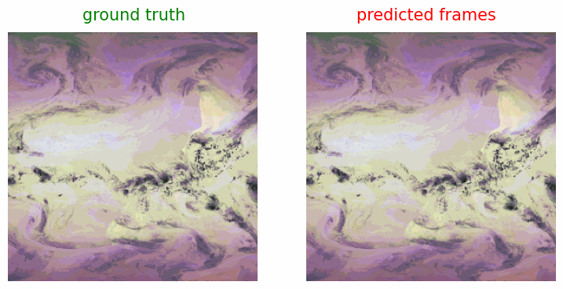

# real-time data-driven cloud forecasting based on geostationary satellite retrievals

Improved cloud forecasting could assist in solar energy projection and satellite information gathering efforts, especially in disaster response. Numerical models cannot explicitly resolve clouds over large geographic domains. Geostationary satellites provide an untapped resource for data-driven methods for cloud forecasting. 

Data is based on a global mosaic consisting of several geostationary satellites positioned at or near the equator from the National Oceanic and Atmospheric Administration (NOAA), The Japan Meteorological Agency (JMA), and the European Organization for the Exploitation of Meteorological Satellites (EUMETSAT). These missions cover the globe from 5 viewing locations: Meteosat-10 located at 0E, and Meteosat-9 located at 45.5E, Himawari-8 and 9 at 140.7E, GOES-17 at 137.2W, and GOES-16 at 75.2W. 

</img>

Coincident sampling exists across these missions from late August 2018 to the present. 11 overlapping bands across the missions include visible to IR. GOES ABI bands: 2,3,5,7,8,10,11,12,13,15,16, Himawari AHI bands: 3,4,5,7,8,10,11,12,13,15,16 and Meteosat SEVIRI bands: 1,2,3,4,5,6,7,8,9,10,11 (the broadband high resolution visible does not appear to be compatible with GOES or Himawari). 

We employ a transformer architecture trained on a novel global mosaic constructed from a constellation of 5 geostationary satellites over 11 visible light and IR channels. Each observation channel captures something unique about the states and flows of moisture and energy in the Earth’s atmosphere. 

Example short-term colorized IR prediction over the Eastern Pacific: 

